# Calourie AI — Smart Nutrition Tracker

Calourie AI is a modern Android application designed to simplify meal tracking using AI-powered food analysis, barcode scanning, and manual entries. Built with **Clean Architecture** and **Jetpack Compose**, it offers a premium, scalable, and highly performant experience.

---

## 📸 Screenshots

### Onboarding
| Gender | Age | Height & Weight | Activity | Goal |
|:---:|:---:|:---:|:---:|:---:|
| 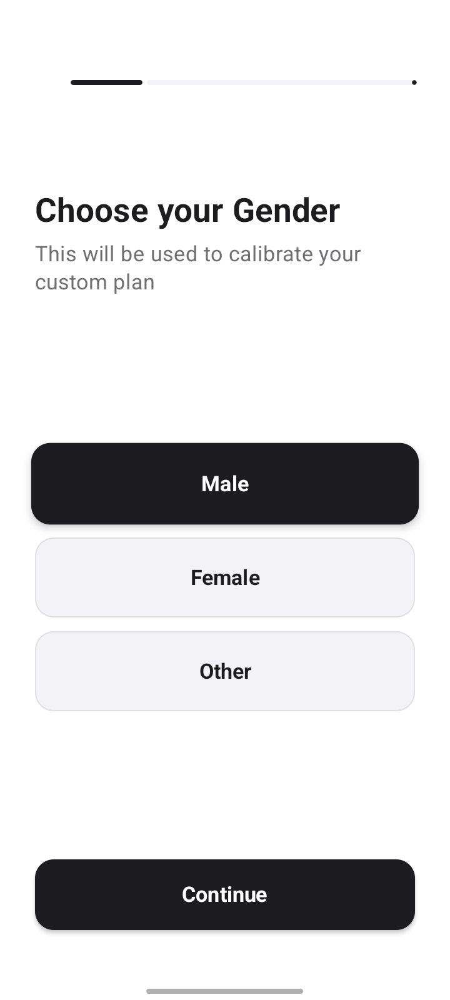 | 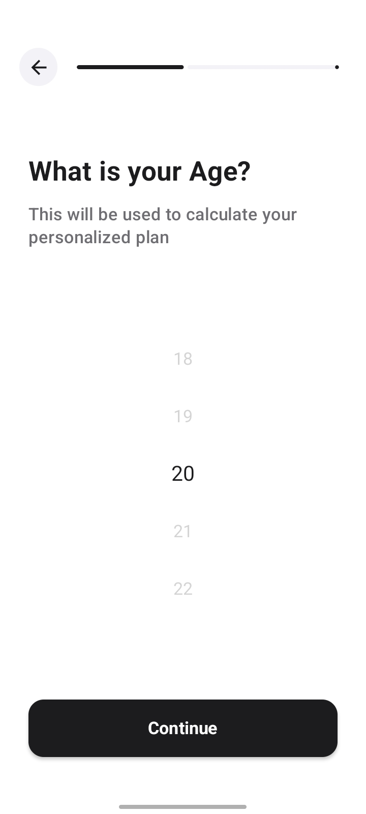 | 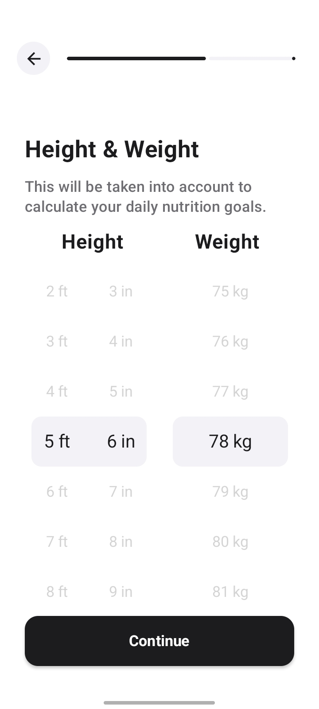 | 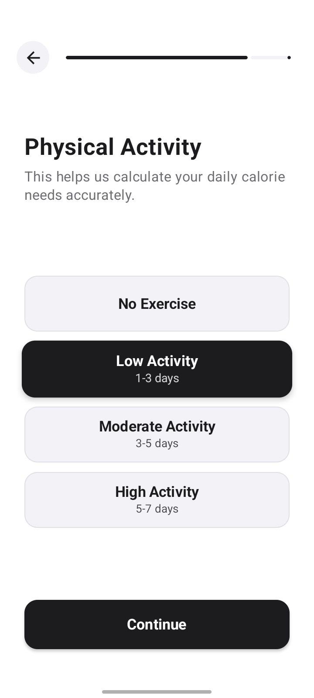 | 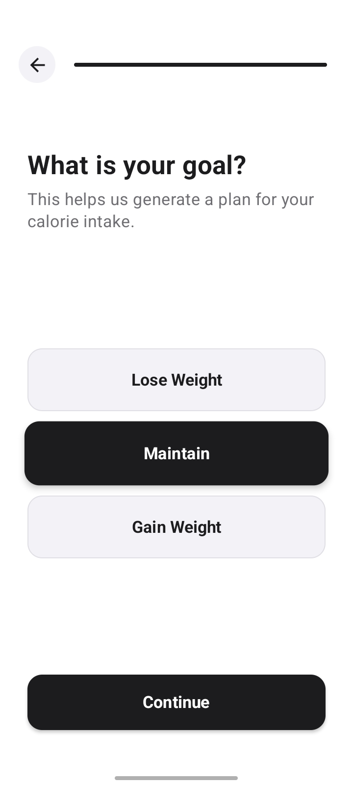 |

### Dashboard
| Home | Meal Logged | Macro Detail | Calorie Log |
|:---:|:---:|:---:|:---:|
| 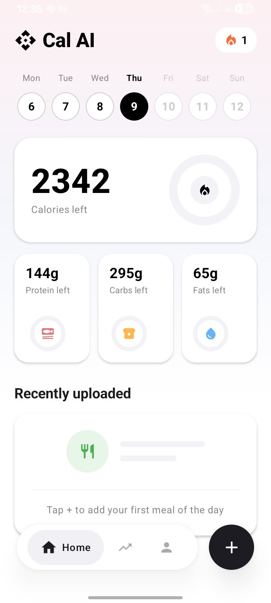 | 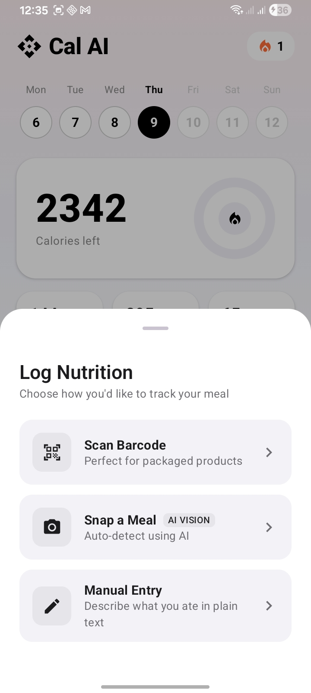 | 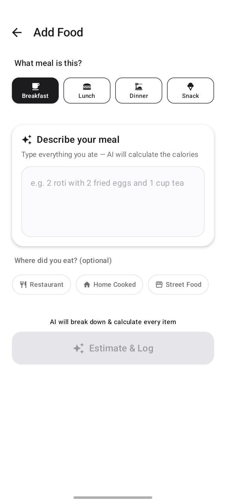 | 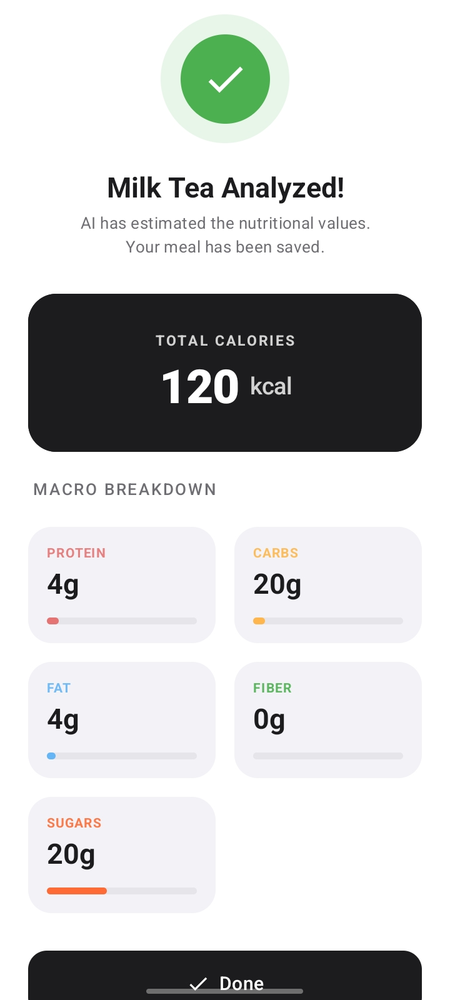 |

### Statistics
| Performance Heatmap | Calorie Balance |
|:---:|:---:|
| 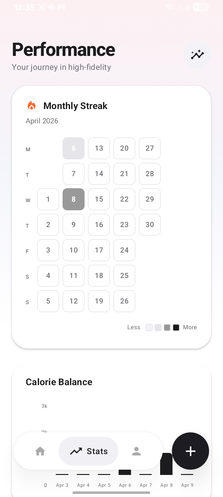 | 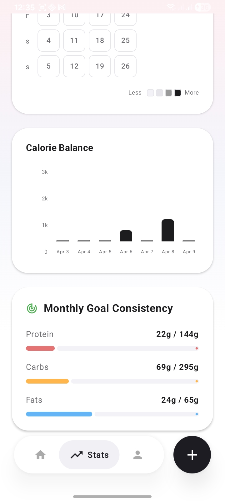 |

### Profile
| My Profile | Activity & Goals |
|:---:|:---:|
| 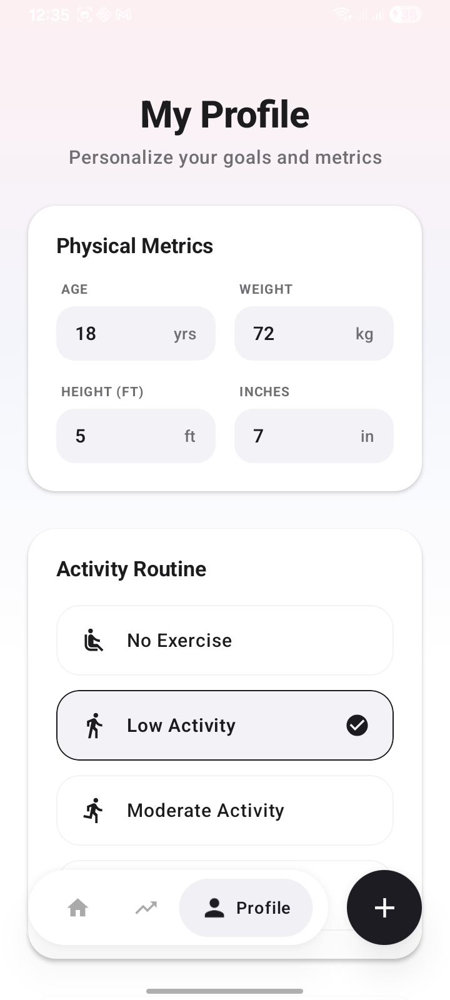 | 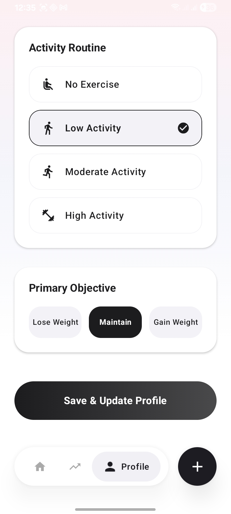 |

---

## 🚀 Tech Stack

| Category | Technology |
|---|---|
| **Language** | Kotlin |
| **UI** | [Jetpack Compose](https://developer.android.com/jetpack/compose) (100% Declarative) |
| **Architecture** | Clean Architecture + MVVM + MVI-lite |
| **DI** | [Hilt](https://developer.android.com/training/dependency-injection/hilt-android) (Dagger Hilt) |
| **Database** | [Room](https://developer.android.com/training/data-storage/room) (Local Persistence) |
| **Networking** | [Retrofit](https://square.github.io/retrofit/) + OkHttp + Gson |
| **Barcode Scanner** | [ML Kit](https://developers.google.com/ml-kit/vision/barcode-scanning) + [CameraX](https://developer.android.com/jetpack/androidx/releases/camera) |
| **AI Nutrition** | Groq API (LLaMA 3.3 70B) |
| **Image Loading** | [Coil](https://coil-kt.github.io/coil/) |
| **Navigation** | [Compose Navigation](https://developer.android.com/jetpack/compose/navigation) (type-safe) |
| **Min SDK** | API 25 (Android 7.1) |
| **Target SDK** | API 36 |

---

## 🏗️ Project Architecture

The application is strictly divided into three layers to ensure separation of concerns and high testability.

### 1. Presentation Layer (UI & State)
Built with **Jetpack Compose**, the UI observes state from **ViewModels** which act as the bridge between the UI and Domain logic.
- **Screens**: Dashboard, Statistics, Profile, Onboarding, AI Vision, Scanner, Manual Entry
- **Navigation**: Bottom dock navigation inside `MainScreen` (3 tabs: Home, Stats, Profile) + top-level navigation for Onboarding and Manual Entry
- **ViewModels**: DashboardViewModel, StatisticsViewModel, ProfileViewModel, AiVisionViewModel, ScanViewModel, ManualEntryViewModel, OnBoardingViewModel, MainViewModel

### 2. Domain Layer (Business Logic)
The heart of the app. Contains pure business rules (UseCases) and Repository interfaces.
- **UseCases (14)**: AddMeal, DeleteMeal, UpdateMealQuantity, ScanProduct, EstimateNutrition, AnalyzeFoodImage, SaveUserAndCalculateGoals, GetGoals, GetMealsByDate, GetTodayNutrimentsSummary, GetScanHistory, GetLoggedDates, CheckUserSession
- **Validation**: ManualEntryValidator, CalculationUtils (BMR, TDEE)

### 3. Data Layer (Persistence & Network)
Handles data fetching and caching. Implements the interfaces defined in the Domain layer.
- **Repositories**: BarcodeRepositoryImpl, UserRepositoryImpl, GroqNutritionRepositoryImpl
- **Local Source**: Room DB v6 (ProductDao, UserDao, ScannedProductDao)
- **Remote**: OpenFoodFacts API + Groq AI API

---

## 📊 System Interaction Diagram

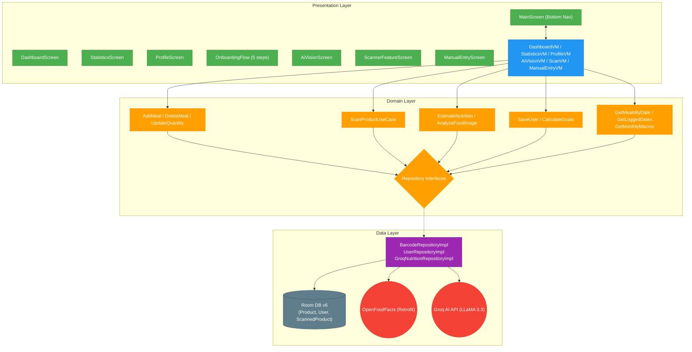

---

## 📁 Directory Structure

```text
app/src/main/java/com/example/calorieapp/
├── Core/                   # Navigation graph, route definitions (Dest sealed interface)
├── DI/                     # Hilt AppModule (singleton wiring)
├── data/
│   ├── DataSource/
│   │   ├── local/          # Room DB, DAOs (Product, User, ScannedProduct), DateConverter
│   │   └── remote/         # Retrofit API services (OpenFoodFacts, Groq), DTOs
│   ├── Models/             # Room entities, Mapper extensions
│   ├── network/
│   │   └── interceptors/   # OkHttp interceptors, RateLimitException, NoConnectivityException
│   └── repository/         # BarcodeRepositoryImpl, UserRepositoryImpl, GroqNutritionRepositoryImpl
├── domain/
│   ├── entities/           # Product, UserProfile, DailyGoals, DailyMacrosSummary, NutritionEstimate
│   ├── repository/         # Repository interfaces (BarcodeRepository, UserRepository, GroqNutritionRepository)
│   ├── useCases/           # 14 use cases covering meals, scanning, AI, user, stats
│   └── validation/         # ManualEntryValidator, CalculationUtils (BMR/TDEE)
├── presentation/
│   ├── components/         # BarcodeScannerView, BarcodeAnalyser, NutritionSummary, WheelPicker, CustomButtons, ConnectivityStatus
│   ├── pages/
│   │   ├── MainScreen.kt           # Root host with floating bottom dock (Home/Stats/Profile tabs)
│   │   ├── DashboardScreen.kt      # Daily calorie & macro tracking
│   │   ├── StatisticsScreen.kt     # Monthly heatmap, calorie balance chart, macro consistency
│   │   ├── ProfileScreen.kt        # Edit physical metrics, activity, and goal
│   │   ├── onboardingScreeen.kt    # Multi-step onboarding host
│   │   ├── DashboardPages/         # Sub-screens: ManualEntry, Scanner, AiVision + components
│   │   └── onboardingPages/        # Step screens: Gender, Age, Height&Weight, Activity, Goal
│   └── viewModel/          # 8 ViewModels
├── ui/theme/               # Color, Type, Theme definitions (CharcoalBlack, GradientPink, etc.)
└── util/                   # ConnectivityObserver
```

---

## ✨ Key Features

- **Smart Barcode Scanning**: Uses ML Kit + CameraX to identify products and fetch nutrition data via OpenFoodFacts. Results cached locally.
- **AI Vision Food Analysis**: Photo-based food recognition powered by Groq AI (LLaMA 3.3 70B) — point your camera at any meal.
- **AI Manual Entry**: Log custom meals using natural language with a multi-step clarification flow for accuracy.
- **Dynamic Dashboard**: Real-time calorie and macro tracking based on personalized daily goals. Date-aware history.
- **Performance Statistics**: GitHub-style monthly consistency heatmap, 7-day calorie balance bar chart, and monthly macro adherence progress bars.
- **Profile Management**: Edit physical metrics (age, weight, height), activity level, and fitness goal — goals recalculate automatically.
- **Goal Calculation**: Automated BMR (Mifflin-St Jeor) and TDEE-based macronutrient goal calculation during onboarding and from the Profile screen.
- **Floating Bottom Dock**: Premium pill-shaped navigation with animated FAB for quick meal logging.
- **Offline Awareness**: ConnectivityObserver blocks scan/AI features when offline with user-friendly feedback.

---

## 📚 Documentation

Detailed documentation is available in the [`docs/`](docs/) directory:

| Document | Description |
|---|---|
| [Architecture Overview](docs/ARCHITECTURE.md) | System architecture, layer diagrams, data flow, and workflow sequences |
| [API Reference](docs/API_REFERENCE.md) | Repository interfaces, remote API services, and all DTOs |
| [Data Layer](docs/DATA_LAYER.md) | Room database schema, entities, DAOs, migrations, and mappers |
| [Domain Layer](docs/DOMAIN_LAYER.md) | Use cases, business entities, validation, and calculation algorithms |
| [Presentation Layer](docs/PRESENTATION_LAYER.md) | ViewModels, screens, components, and navigation |
| [Dependency Injection](docs/DEPENDENCY_INJECTION.md) | Hilt module wiring, dependency graph, and provider details |
| [Network & Security](docs/NETWORK_AND_SECURITY.md) | Interceptors, connectivity monitoring, and error handling |
| [Setup Guide](docs/SETUP_GUIDE.md) | Prerequisites, API key configuration, build, and troubleshooting |

---

## 🛠️ Installation & Setup

1. **Clone the repository**:
   ```bash
   git clone https://github.com/saqibcheema/calourie_ai.git
   ```
2. **Open in Android Studio**:
   - Ensure you have **Android Studio Ladybug (or newer)** installed.
3. **Configure API keys** — see [Setup Guide](docs/SETUP_GUIDE.md) for Groq API key setup.
4. **Build & Run**:
   - Let Gradle sync complete.
   - Run on an Emulator or Physical Device (API 25+).

---

## 📄 License
This project is for educational/personal use. Please check OpenFoodFacts and Groq for data usage policies.
