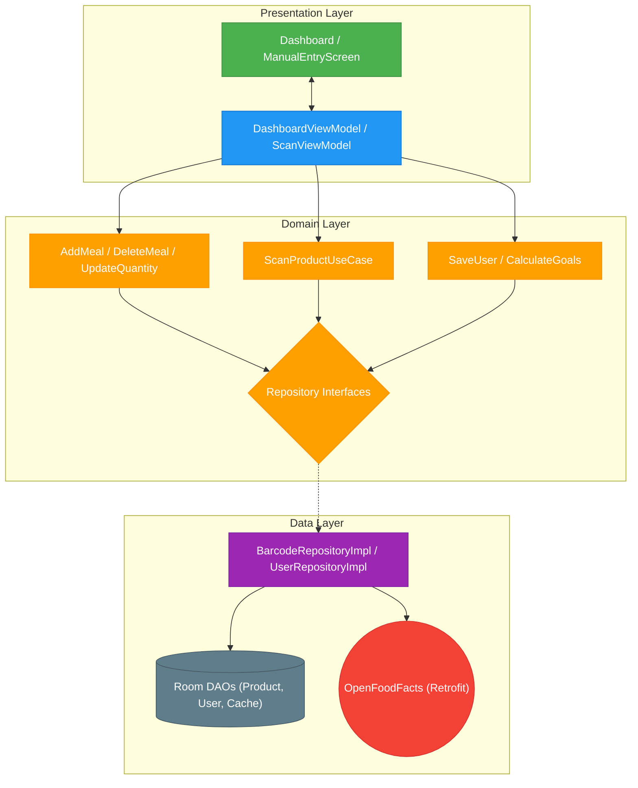

# Calourie AI - Smart Nutrition Tracker

Calourie AI is a modern Android application designed to simplify meal tracking using AI-powered barcode scanning and manual entries. Built with **Clean Architecture** and **Jetpack Compose**, it offers a premium, scalable, and highly performant experience.

---

## 🚀 Tech Stack

- **UI**: [Jetpack Compose](https://developer.android.com/jetpack/compose) (100% Declarative UI)
- **Architecture**: Clean Architecture + MVVM + MVI-lite
- **DI**: [Hilt](https://developer.android.com/training/dependency-injection/hilt-android) (Dagger Hilt)
- **Database**: [Room](https://developer.android.com/training/data-storage/room) (Local Persistence)
- **Networking**: [Retrofit](https://square.github.io/retrofit/) + [Gson](https://github.com/google/gson) (OpenFoodFacts API)
- **Scanner**: [ML Kit](https://developers.google.com/ml-kit/vision/barcode-scanning) + [CameraX](https://developer.android.com/jetpack/androidx/releases/camera)
- **Image Loading**: [Coil](https://coil-kt.github.io/coil/)
- **Navigation**: [Compose Navigation](https://developer.android.com/jetpack/compose/navigation)

---

## 🏗️ Project Architecture

The application is strictly divided into three layers to ensure separation of concerns and high testability.

### 1. Presentation Layer (UI & State)
Built with **Jetpack Compose**, the UI observes state from **ViewModels** which act as the bridge between the UI and Domain logic.
- **ViewModels**: [DashboardViewModel](file:///e:/Desktop/calourie_ai/app/src/main/java/com/example/calorieapp/presentation/viewModel/DashboardViewModel.kt), [ScanViewModel](file:///e:/Desktop/calourie_ai/app/src/main/java/com/example/calorieapp/presentation/viewModel/ScanViewModel.kt)
- **Navigation**: Managed in [CalorieNavigation](file:///e:/Desktop/calourie_ai/app/src/main/java/com/example/calorieapp/Core/CalorieNavigation.kt)

### 2. Domain Layer (Business Logic)
The heart of the app. Contains pure business rules (UseCases) and Repository interfaces.
- **UseCases**: [AddMealUseCase](file:///e:/Desktop/calourie_ai/app/src/main/java/com/example/calorieapp/domain/useCases/AddMealUseCase.kt), [ScanProductUseCase](file:///e:/Desktop/calourie_ai/app/src/main/java/com/example/calorieapp/domain/useCases/ScanProductUseCase.kt)
- **Validation**: [ManualEntryValidator](file:///e:/Desktop/calourie_ai/app/src/main/java/com/example/calorieapp/domain/validation/ManualEntryValidator.kt)

### 3. Data Layer (Persistence & Network)
Handles data fetching and caching. Implements the interfaces defined in the Domain layer.
- **Repositories**: [BarcodeRepositoryImpl](file:///e:/Desktop/calourie_ai/app/src/main/java/com/example/calorieapp/data/repository/BarcodeRepositoryImpl.kt)
- **Local Source**: Room DB ([AppDatabase](file:///e:/Desktop/calourie_ai/app/src/main/java/com/example/calorieapp/data/DataSource/local/AppDatabase.kt))

---

## 📊 System Interaction Diagram

This diagram visualizes the flow of data through the system, covering both **Scanning** and **Manual Entry** workflows.



---

## 📁 Directory Structure

```text
app/src/main/java/com/example/calorieapp/
├── Core/               # Navigation, Routes, Constants
├── DI/                 # Hilt Modules (Dependency Injection)
├── data/               
│   ├── DataSource/     # Local (Room) & Remote (Retrofit)
│   ├── Models/         # Entities, Mappers, DTOs
│   └── repository/     # Repository Implementations
├── domain/             
│   ├── entities/       # Pure Business Objects
│   ├── repository/     # Repository Interfaces
│   ├── useCases/       # Individual Business Logic (UseCases)
│   └── validation/     # Business Validation (e.g., Manual Entry)
├── presentation/       
│   ├── pages/          # Compose Screens (Dashboard, Scanner, Manual)
│   └── viewModel/      # UI Logic & State Management
└── ui/                 # Themes, Color, Typography
```

---

## ✨ Key Features

- **Smart Barcode Scanning**: Uses ML Kit to identify products and fetch nutrition data via OpenFoodFacts.
- **Structured Manual Entry**: Log custom meals with validation for portions, grams, and meal types.
- **Dynamic Dashboard**: Real-time calorie and macro tracking based on your daily goals.
- **Goal Calculation**: Automated BMR and macronutrient goal calculation during onboarding.
- **Search & History**: Quickly access previously scanned items from the local cache.

---

## 📚 Documentation

Detailed documentation is available in the [`docs/`](docs/) directory:

| Document | Description |
|---|---|
| [Architecture Overview](docs/ARCHITECTURE.md) | System architecture, layer diagrams, data flow, and workflow sequences |
| [API Reference](docs/API_REFERENCE.md) | Repository interfaces, remote API services, and all DTOs |
| [Data Layer](docs/DATA_LAYER.md) | Room database schema, entities, DAOs, migrations, and mappers |
| [Domain Layer](docs/DOMAIN_LAYER.md) | Use cases, business entities, validation, and calculation algorithms |
| [Presentation Layer](docs/PRESENTATION_LAYER.md) | ViewModels, screens, components, and navigation |
| [Dependency Injection](docs/DEPENDENCY_INJECTION.md) | Hilt module wiring, dependency graph, and provider details |
| [Network & Security](docs/NETWORK_AND_SECURITY.md) | Interceptors, connectivity monitoring, and error handling |
| [Setup Guide](docs/SETUP_GUIDE.md) | Prerequisites, API key configuration, build, and troubleshooting |

---

## 🛠️ Installation & Setup

1. **Clone the repository**:
   ```bash
   git clone https://github.com/saqibcheema/calourie_ai.git
   ```
2. **Open in Android Studio**:
   - Ensure you have **Android Studio Ladybug (or newer)** installed.
3. **Build & Run**:
   - Let Gradle sync complete.
   - Run on an Emulator or Physical Device (API 25+).

---

## 📄 License
This project is for educational/personal use. Please check OpenFoodFacts for data usage policies.
