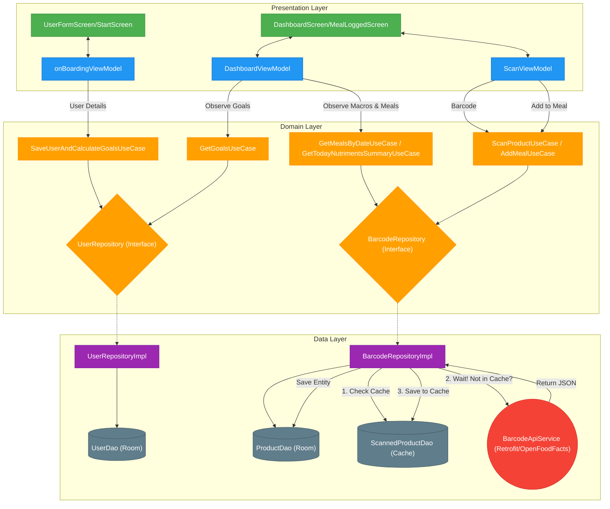

# Complete App Architecture Analysis Walkthrough

Calourie AI is built using a modern Android tech stack utilizing **Clean Architecture** combined with the **Model-View-ViewModel (MVVM)** pattern. This ensures that the app is scalable, testable, and maintainable.

## 1. Layers Overview

The application is strictly divided into three layers:

- **1. Presentation Layer (UI & ViewModels)**
  The UI is built entirely with **Jetpack Compose**. The state is managed by **ViewModels** which collect data from the Domain layer and expose it as `StateFlow` to the UI components.
  - **Key Screens**: [DashboardScreen](file:///e:/Desktop/calourie_ai/app/src/main/java/com/example/calorieapp/presentation/pages/DashboardScreen.kt#31-237), [MealLoggedScreen](file:///e:/Desktop/calourie_ai/app/src/main/java/com/example/calorieapp/presentation/pages/DashboardPages/MealLoggedScreen.kt#23-226), `UserFormScreen`, `StartScreen`
  - **ViewModels**: [DashboardViewModel](file:///e:/Desktop/calourie_ai/app/src/main/java/com/example/calorieapp/presentation/viewModel/DashboardViewModel.kt#19-49), [ScanViewModel](file:///e:/Desktop/calourie_ai/app/src/main/java/com/example/calorieapp/presentation/viewModel/ScanViewModel.kt#15-79), `onBoardingViewModel`, `MainViewModel`

- **2. Domain Layer (Business Logic)**
  This is the core of the app. It does not know anything about Android Frameworks, UI, or databases. It only contains the business rules.
  - **UseCases**: Encapsulate a single task (e.g., [AddMealUseCase](file:///e:/Desktop/calourie_ai/app/src/main/java/com/example/calorieapp/domain/useCases/AddMealUseCase.kt#7-14), `SaveUserAndCalculateGoalsUseCase`, [GetMealsByDateUseCase](file:///e:/Desktop/calourie_ai/app/src/main/java/com/example/calorieapp/domain/useCases/GetMealsByDateUseCase.kt#8-15)).
  - **Interfaces**: Defines the contracts for repositories ([BarcodeRepository](file:///e:/Desktop/calourie_ai/app/src/main/java/com/example/calorieapp/domain/repository/BarcodeRepository.kt#7-16), [UserRepository](file:///e:/Desktop/calourie_ai/app/src/main/java/com/example/calorieapp/DI/AppModule.kt#46-53)).
  - **Entities**: Pure Kotlin data classes ([Product](file:///e:/Desktop/calourie_ai/app/src/main/java/com/example/calorieapp/domain/entities/Product.kt#5-24), [DailyGoals](file:///e:/Desktop/calourie_ai/app/src/main/java/com/example/calorieapp/data/Models/Mappers.kt#41-49)).

- **3. Data Layer**
  Responsible for fetching, saving, and caching data. It implements the interfaces defined in the Domain layer.
  - **Repositories**: [BarcodeRepositoryImpl](file:///e:/Desktop/calourie_ai/app/src/main/java/com/example/calorieapp/data/repository/BarcodeRepositoryImpl.kt#17-91), `UserRepositoryImpl` coordinate between data sources.
  - **Local Source**: **Room Database** ([AppDatabase](file:///e:/Desktop/calourie_ai/app/src/main/java/com/example/calorieapp/data/DataSource/local/AppDatabase.kt#11-18), [ProductDao](file:///e:/Desktop/calourie_ai/app/src/main/java/com/example/calorieapp/data/DataSource/local/ProductDao.kt#11-43), [UserDao](file:///e:/Desktop/calourie_ai/app/src/main/java/com/example/calorieapp/DI/AppModule.kt#40-45), [ScannedProductDao](file:///e:/Desktop/calourie_ai/app/src/main/java/com/example/calorieapp/data/DataSource/local/ScannedProductDao.kt#9-18)) stores [ScannedProductEntity](file:///e:/Desktop/calourie_ai/app/src/main/java/com/example/calorieapp/data/Models/ScannedProductEntity.kt#8-25) and [ProductEntity](file:///e:/Desktop/calourie_ai/app/src/main/java/com/example/calorieapp/data/Models/ProductEntity.kt#8-26).
  - **Remote Source**: **Retrofit** (`BarcodeApiService`) fetches barcode products from *OpenFoodFacts*.

---

## 2. Complete Interaction Diagram

The diagram below shows exactly how the code interacts with each other. It maps the two primary workflows: **1) Onboarding/User Profile Setup**, and **2) Scanning & Logging Meals**.

---

## 3. Step-by-Step Data Flow Example

To understand how the layers connect, let's trace what happens when you **Scan a Barcode and Add it to a Meal**:

1. **User taps Scanner on [DashboardScreen](file:///e:/Desktop/calourie_ai/app/src/main/java/com/example/calorieapp/presentation/pages/DashboardScreen.kt#31-237)**: The camera opens via CameraX/MLKit. A barcode string is detected.
2. **[ScanViewModel](file:///e:/Desktop/calourie_ai/app/src/main/java/com/example/calorieapp/presentation/viewModel/ScanViewModel.kt#15-79)**: Receives the string and calls [ScanProductUseCase](file:///e:/Desktop/calourie_ai/app/src/main/java/com/example/calorieapp/domain/useCases/ScanProductUseCase.kt#7-19).
3. **[ScanProductUseCase](file:///e:/Desktop/calourie_ai/app/src/main/java/com/example/calorieapp/domain/useCases/ScanProductUseCase.kt#7-19)**: Calls `BarcodeRepository.scanProduct(barcode)`.
4. **[BarcodeRepositoryImpl](file:///e:/Desktop/calourie_ai/app/src/main/java/com/example/calorieapp/data/repository/BarcodeRepositoryImpl.kt#17-91)**:
   - First, checks [ScannedProductDao](file:///e:/Desktop/calourie_ai/app/src/main/java/com/example/calorieapp/data/DataSource/local/ScannedProductDao.kt#9-18) (Cache table) to see if it was scanned before.
   - If not found, calls `BarcodeApiService.getProductByBarcode` using Retrofit to get data from OpenFoodFacts.
   - Saves the fresh data into the Cache table via `ScannedProductDao.insertScannedProduct(product)`.
   - Returns a pure [Product](file:///e:/Desktop/calourie_ai/app/src/main/java/com/example/calorieapp/domain/entities/Product.kt#5-24) domain object back up the chain.
5. **[MealLoggedScreen](file:///e:/Desktop/calourie_ai/app/src/main/java/com/example/calorieapp/presentation/pages/DashboardPages/MealLoggedScreen.kt#23-226)**: The UI updates to show the product details with an **"Add to Meal"** button.
6. **User taps "Add to Meal"**: 
   - [ScanViewModel](file:///e:/Desktop/calourie_ai/app/src/main/java/com/example/calorieapp/presentation/viewModel/ScanViewModel.kt#15-79) fires [AddMealUseCase(product)](file:///e:/Desktop/calourie_ai/app/src/main/java/com/example/calorieapp/domain/useCases/AddMealUseCase.kt#7-14).
   - [BarcodeRepositoryImpl](file:///e:/Desktop/calourie_ai/app/src/main/java/com/example/calorieapp/data/repository/BarcodeRepositoryImpl.kt#17-91) is told to permanently log the item.
   - It converts the [Product](file:///e:/Desktop/calourie_ai/app/src/main/java/com/example/calorieapp/domain/entities/Product.kt#5-24) back into a [ProductEntity](file:///e:/Desktop/calourie_ai/app/src/main/java/com/example/calorieapp/data/Models/ProductEntity.kt#8-26) and saves it into the Meal Log table via `ProductDao.insertProduct(entity)`.
7. **[DashboardViewModel](file:///e:/Desktop/calourie_ai/app/src/main/java/com/example/calorieapp/presentation/viewModel/DashboardViewModel.kt#19-49) Reacts**: Because it collects `getMealsByDateUseCase` and `getTodayNutrimentsSummaryUseCase` as *StateFlows* directly from Room, the Dashboard UI instantly highlights the new calories and displays the meal item dynamically!
