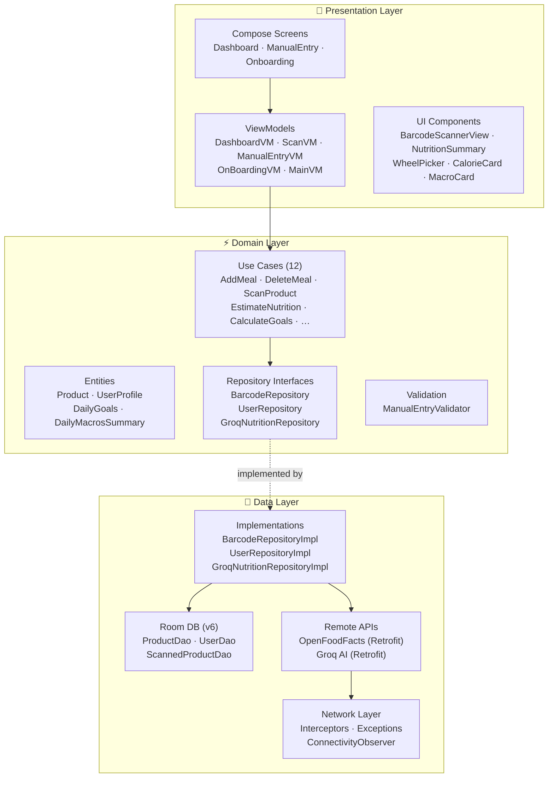
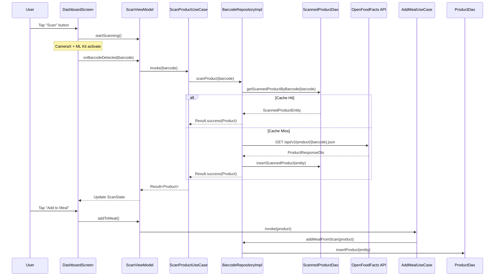
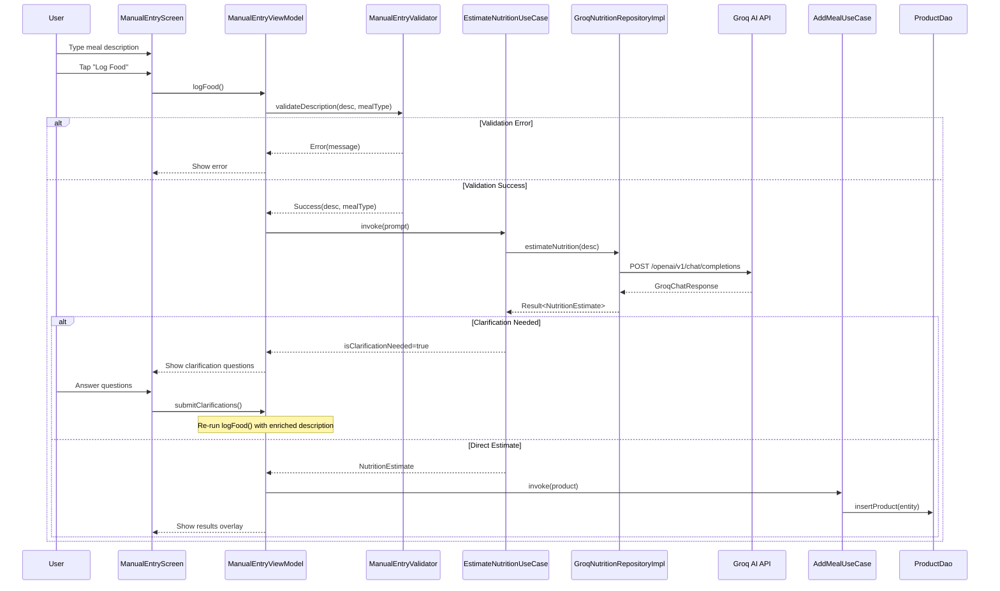
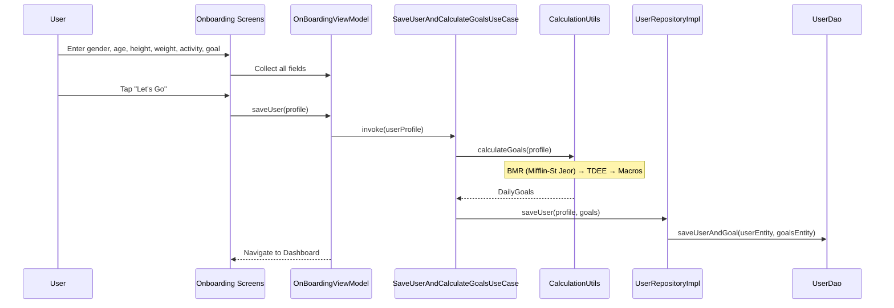
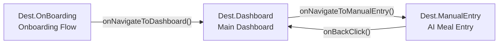

# Architecture Overview

Calourie AI follows **Clean Architecture** with a strict layered dependency model. Data flows inward: the **Presentation** layer depends on **Domain**, and the **Data** layer implements **Domain** interfaces — but the Domain layer has zero knowledge of either.

---

## Technology Stack

| Category | Technology |
|---|---|
| **Language** | Kotlin |
| **UI Framework** | Jetpack Compose (100% Declarative) |
| **Architecture** | Clean Architecture + MVVM + MVI-lite |
| **DI** | Dagger Hilt |
| **Database** | Room (SQLite) |
| **Networking** | Retrofit + OkHttp + Gson |
| **Barcode Scanning** | ML Kit + CameraX |
| **AI Nutrition** | Groq API (LLaMA 3.3 70B) |
| **Image Loading** | Coil |
| **Navigation** | Compose Navigation (type-safe) |
| **Min SDK** | API 25 (Android 7.1) |
| **Target SDK** | API 36 |

---

## Layer Diagram



---

## Dependency Direction

```
Presentation  ──depends on──►  Domain  ◄──implements──  Data
```

- **Domain** is the innermost layer — pure Kotlin, no Android dependencies
- **Presentation** observes `StateFlow`s exposed by ViewModels
- **Data** provides concrete repository implementations injected via Hilt

---

## Package Structure

```text
app/src/main/java/com/example/calorieapp/
├── Core/                   # Navigation graph, route definitions
├── DI/                     # Hilt AppModule (singleton wiring)
├── data/
│   ├── DataSource/
│   │   ├── local/          # Room DB, DAOs, DateConverter
│   │   └── remote/         # Retrofit API services, DTOs
│   ├── Models/             # Room entities, Mapper extensions
│   ├── network/
│   │   └── interceptors/   # OkHttp interceptors, custom exceptions
│   └── repository/         # Repository implementations
├── domain/
│   ├── entities/           # Pure business objects
│   ├── repository/         # Repository interfaces (contracts)
│   ├── useCases/           # Business logic, calculations
│   └── validation/         # Input validation
├── presentation/
│   ├── components/         # Reusable Compose components
│   ├── pages/              # Screen composables
│   │   ├── DashboardPages/ # Dashboard sub-screens, ManualEntry
│   │   └── onBoradingPages/# Onboarding step screens
│   └── viewModel/          # ViewModels (state management)
├── ui/theme/               # Color, Type, Theme definitions
└── util/                   # Connectivity observer
```

---

## Core Workflows

### 1. Barcode Scanning Flow



### 2. AI Manual Entry Flow



### 3. Onboarding & Goal Calculation Flow



---

## Navigation Graph



**Start destination** is determined at runtime by `MainViewModel.checkUserSession()`:
- If user exists → `Dest.Dashboard`
- If no user → `Dest.OnBoarding`
