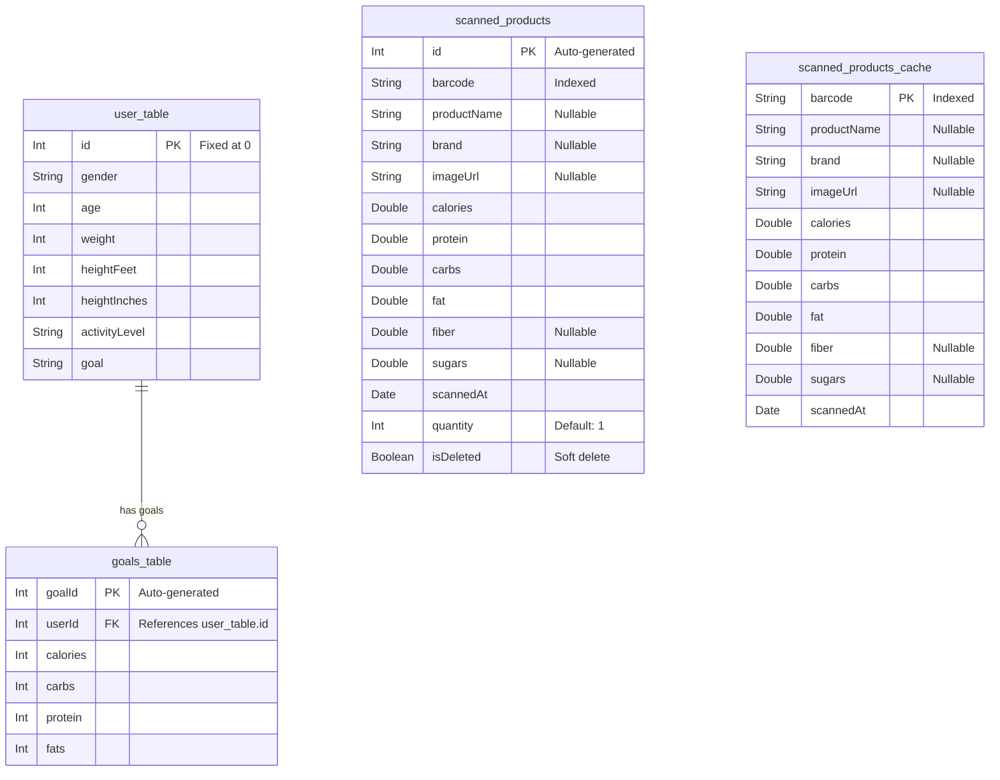

# Data Layer Documentation

The Data layer implements the repository interfaces defined in the Domain layer. It manages local persistence via Room and remote data fetching via Retrofit.

---

## Room Database

> **File**: [AppDatabase.kt](file:///e:/Desktop/calourie_ai/app/src/main/java/com/example/calorieapp/data/DataSource/local/AppDatabase.kt)

- **Database Name**: `calorie_app_db`
- **Current Version**: `6`
- **Export Schema**: `false`
- **Type Converters**: `DateConverter` (converts `java.util.Date` ↔ `Long` timestamps)

### Entity-Relationship Diagram

---

## Entities

### UserEntity
> **Table**: `user_table`
> **File**: [UserEntity.kt](file:///e:/Desktop/calourie_ai/app/src/main/java/com/example/calorieapp/data/Models/UserEntity.kt)

Stores the single user profile. Uses a **fixed primary key** (`id = 0`) so `INSERT OR REPLACE` effectively creates an upsert.

### GoalsEntity
> **Table**: `goals_table`
> **File**: [GoalsEntity.kt](file:///e:/Desktop/calourie_ai/app/src/main/java/com/example/calorieapp/data/Models/GoalsEntity.kt)

Linked to `UserEntity` via a **foreign key** with `CASCADE` delete. Stores the calculated daily macro targets.

### ProductEntity
> **Table**: `scanned_products`
> **File**: [ProductEntity.kt](file:///e:/Desktop/calourie_ai/app/src/main/java/com/example/calorieapp/data/Models/ProductEntity.kt)

Main meal log table. Each row represents one logged meal (scanned or manually entered).

Key design decisions:
- **Auto-generated PK** (`id`) — allows multiple entries with the same barcode on different days
- **Soft delete** (`isDeleted: Boolean`) — entries are marked as deleted rather than physically removed
- **Indexed** on `barcode` for fast lookups
- **Quantity tracking** — `quantity` field allows the user to adjust serving counts

### ScannedProductEntity
> **Table**: `scanned_products_cache`
> **File**: [ScannedProductEntity.kt](file:///e:/Desktop/calourie_ai/app/src/main/java/com/example/calorieapp/data/Models/ScannedProductEntity.kt)

API response cache. Stores previously fetched product data from OpenFoodFacts to avoid redundant network requests.

Key design decisions:
- **Barcode as PK** — ensures one cache entry per product
- `INSERT OR REPLACE` strategy — automatically updates stale cache entries
- No `quantity` or `isDeleted` fields — this is purely a cache, not a user-facing log

---

## DAOs

### UserDao
> **File**: [UserDao.kt](file:///e:/Desktop/calourie_ai/app/src/main/java/com/example/calorieapp/data/DataSource/local/UserDao.kt)

| Method | Type | Description |
|---|---|---|
| `insertUser(user)` | `suspend` | Insert/replace user profile |
| `insertGoal(goal)` | `suspend` | Insert/replace goals |
| `saveUserAndGoal(user, goal)` | `@Transaction suspend` | Atomic insert of both user and goals |
| `getUser()` | `Flow<UserEntity?>` | Observe user profile (where `id = 0`) |
| `getGoals()` | `Flow<GoalsEntity?>` | Observe goals (where `userId = 0`) |

### ProductDao
> **File**: [ProductDao.kt](file:///e:/Desktop/calourie_ai/app/src/main/java/com/example/calorieapp/data/DataSource/local/ProductDao.kt)

| Method | Type | Description |
|---|---|---|
| `insertProduct(product)` | `suspend` | Insert a new meal log row |
| `getAllScannedProducts()` | `Flow<List<ProductEntity>>` | All non-deleted products, DESC by `scannedAt` |
| `getProductByBarcode(barcode)` | `suspend` | Get latest active product by barcode |
| `softDeleteProduct(barcode)` | `suspend` | Set `isDeleted = 1` on the latest entry |
| `updateProductQuantity(barcode, qty)` | `suspend` | Update quantity on the latest active entry |
| `deleteOldProducts()` | `suspend` | Permanently remove soft-deleted entries |
| `getMealsByDate(date)` | `Flow<List<ProductEntity>>` | Active meals for a specific date |
| `getTodayTotalMacros(date)` | `Flow<DailyMacrosSummary?>` | Aggregated `SUM(macro * quantity)` for a date |

### ScannedProductDao
> **File**: [ScannedProductDao.kt](file:///e:/Desktop/calourie_ai/app/src/main/java/com/example/calorieapp/data/DataSource/local/ScannedProductDao.kt)

| Method | Type | Description |
|---|---|---|
| `insertScannedProduct(product)` | `suspend` | Cache a product from API (REPLACE on conflict) |
| `getScannedProductByBarcode(barcode)` | `suspend` | Lookup cached product |

---

## Migration History

| Migration | Changes |
|---|---|
| **v3 → v4** | Added `quantity INTEGER NOT NULL DEFAULT 1` column to `scanned_products` |
| **v4 → v5** | Cleared `scanned_products_cache` table to force re-fetch with new scaled nutritional values |
| **v5 → v6** | Recreated `scanned_products` table with auto-increment `id` PK (previously used a composite key). Migrated existing data via `INSERT INTO ... SELECT` |

> **Note**: The database also has `fallbackToDestructiveMigration()` enabled as a safety net.

---

## Mappers

> **File**: [Mappers.kt](file:///e:/Desktop/calourie_ai/app/src/main/java/com/example/calorieapp/data/Models/Mappers.kt)

Extension functions that convert between Data (Entity) and Domain objects:

| Function | Direction | Notes |
|---|---|---|
| `UserProfile.toUserEntity()` | Domain → Entity | Converts `weight: String` to `Int` |
| `UserEntity.toUserProfile()` | Entity → Domain | Converts `weight: Int` to `String` |
| `DailyGoals.toGoalsEntity(userId)` | Domain → Entity | Accepts optional `userId` param |
| `GoalsEntity.toDailyGoals()` | Entity → Domain | — |
| `ProductEntity.toDomainProduct()` | Entity → Domain | Includes `quantity` |
| `Product.toEntity()` | Domain → Entity | Includes `quantity` |
| `ScannedProductEntity.toDomainProduct()` | Cache Entity → Domain | No `quantity` field |
| `ScannedProductEntity.toProductEntity()` | Cache → Meal Entity | For promoting cached items to meal log |
| `Product.toScannedEntity()` | Domain → Cache Entity | For caching API responses |

---

## Repository Implementations

### BarcodeRepositoryImpl
> **File**: [BarcodeRepositoryImpl.kt](file:///e:/Desktop/calourie_ai/app/src/main/java/com/example/calorieapp/data/repository/BarcodeRepositoryImpl.kt)

Implements `BarcodeRepository`. Key logic:
- **`scanProduct(barcode)`**: Cache-first strategy — checks `ScannedProductDao` before calling OpenFoodFacts API
- **`addMealFromScan(product)`**: Checks for existing active entries with same barcode; if found, increments quantity instead of inserting a duplicate
- **`addMeal(meal)`**: Direct insert for manually entered meals (always new row)

### UserRepositoryImpl
> **File**: [UserRepositoryImpl.kt](file:///e:/Desktop/calourie_ai/app/src/main/java/com/example/calorieapp/data/repository/UserRepositoryImpl.kt)

Implements `UserRepository`. Delegates directly to `UserDao` with entity↔domain conversion via mappers.

### GroqNutritionRepositoryImpl
> **File**: [GroqNutritionRepositoryImpl.kt](file:///e:/Desktop/calourie_ai/app/src/main/java/com/example/calorieapp/data/repository/GroqNutritionRepositoryImpl.kt)

Implements `GroqNutritionRepository`. Key logic:
- Constructs a system prompt instructing the LLM to return structured JSON
- Sends the user's food description to the Groq API
- Parses the JSON response into a `NutritionEstimate` object
- Handles the AI clarification flow when the model needs more information
