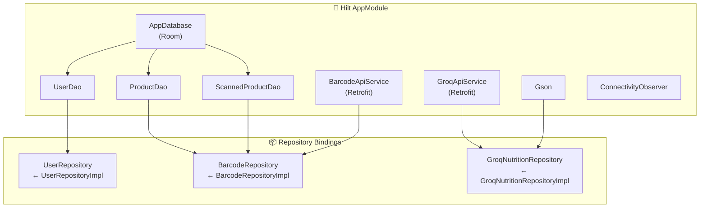

# Dependency Injection Documentation

Calourie AI uses **Dagger Hilt** for dependency injection. All dependencies are wired through a single `AppModule` installed in the `SingletonComponent`.

---

## Module Overview

> **File**: [AppModule.kt](file:///e:/Desktop/calourie_ai/app/src/main/java/com/example/calorieapp/DI/AppModule.kt)

```kotlin
@Module
@InstallIn(SingletonComponent::class)
object AppModule { ... }
```

All providers are `@Singleton` scoped, ensuring one instance per application lifecycle.

---

## Dependency Graph



---

## Provider Details

### Database

```kotlin
@Provides @Singleton
fun provideDatabase(@ApplicationContext context: Context): AppDatabase
```

- Creates Room database `"calorie_app_db"`
- Registers 3 migrations (v3→4, v4→5, v5→6)
- Enables `fallbackToDestructiveMigration()` as a safety net

### DAOs

| Provider | Returns | Source |
|---|---|---|
| `provideUserDao(db)` | `UserDao` | `db.userDao()` |
| `provideProductDao(db)` | `ProductDao` | `db.ProductDao()` |
| `provideScannedProductDao(db)` | `ScannedProductDao` | `db.scannedProductDao()` |

### API Services

#### BarcodeApiService (OpenFoodFacts)

```kotlin
@Provides @Singleton
fun provideBarcodeApi(@ApplicationContext context: Context): BarcodeApiService
```

**OkHttp Configuration**:
| Interceptor | Purpose |
|---|---|
| `NetworkConnectionInterceptor` | Throws `NoConnectivityException` if offline |
| `RateLimitInterceptor` | Throttles to 1 request per 2 seconds |

**Timeouts**: Connect 15s, Read 15s
**Base URL**: `https://world.openfoodfacts.org/`

#### GroqApiService (Groq AI)

```kotlin
@Provides @Singleton
fun provideGroqApi(@ApplicationContext context: Context): GroqApiService
```

**OkHttp Configuration**:
| Interceptor | Purpose |
|---|---|
| `NetworkConnectionInterceptor` | Throws `NoConnectivityException` if offline |
| `RateLimitInterceptor` | Throttles to 1 request per 2 seconds |
| `GroqAuthInterceptor` | Adds `Authorization: Bearer {GROQ_API_KEY}` header |
| `HttpLoggingInterceptor` | Logs full request/response bodies (debug) |

**Timeouts**: Connect 30s, Read 60s (longer for AI inference)
**Base URL**: `https://api.groq.com/`

### Repository Bindings

Each binding maps an interface to its implementation using Hilt's constructor injection:

| Provider | Interface | Implementation |
|---|---|---|
| `provideUserRepository` | `UserRepository` | `UserRepositoryImplementation` |
| `provideBarcodeRepository` | `BarcodeRepository` | `BarcodeRepositoryImpl` |
| `provideGroqNutritionRepository` | `GroqNutritionRepository` | `GroqNutritionRepositoryImpl` |

### Utilities

| Provider | Returns | Description |
|---|---|---|
| `provideConnectivityObserver` | `ConnectivityObserver` | `NetworkConnectivityObserver` instance |
| `provideGson` | `Gson` | Default Gson instance for JSON parsing |

---

## Application Entry Point

> **File**: [BaseApplication.kt](file:///e:/Desktop/calourie_ai/app/src/main/java/com/example/calorieapp/BaseApplication.kt)

```kotlin
@HiltAndroidApp
class BaseApplication : Application()
```

> **File**: [MainActivity.kt](file:///e:/Desktop/calourie_ai/app/src/main/java/com/example/calorieapp/MainActivity.kt)

```kotlin
@AndroidEntryPoint
class MainActivity : ComponentActivity()
```

The activity uses `MainViewModel` to determine the start destination, then renders `CalorieAppNavigation`.
